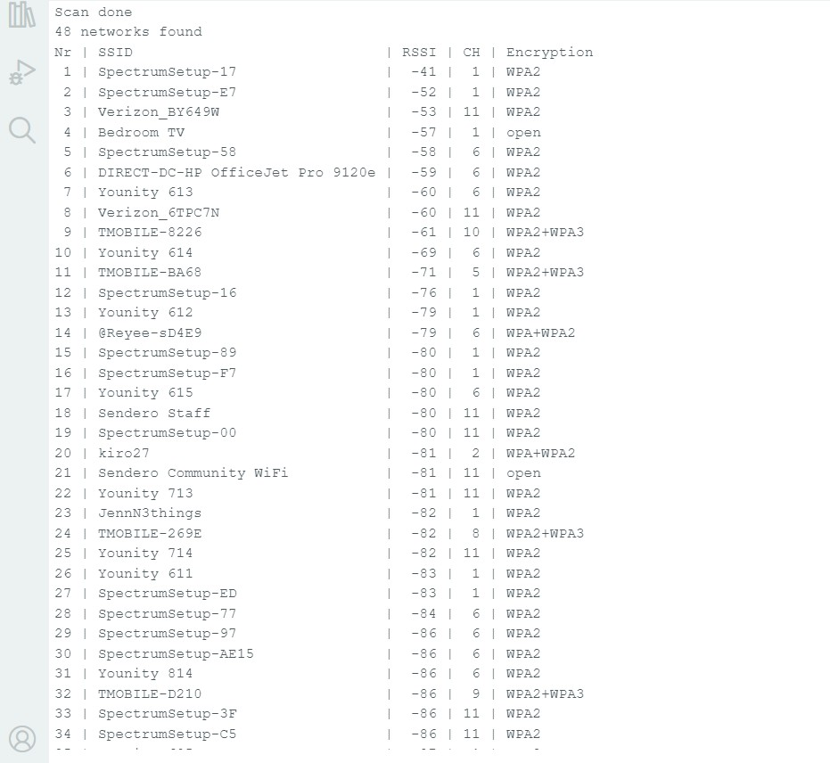

# ESP32-Wifi-Scanner
# WiFiScan Example
This example demonstrates how to use the WiFi library to scan available WiFi networks and print the results.
Go to File>Examples>Wifi>WifiScan

## How to Use Example

* How to install the Arduino IDE: [Install Arduino IDE](https://github.com/espressif/arduino-esp32/tree/master/docs/arduino-ide).

#### Using Arduino IDE

* Before Compile/Verify, select the correct board: `Tools -> Board`.
* Select the COM port: `Tools -> Port: xxx` where the `xxx` is the detected COM port.

#### Using Platform IO

* Select the COM port: `Devices` or setting the `upload_port` option on the `platformio.ini` file.

## Example/Log Output

## Troubleshooting

***Important: Be sure you're using a good quality USB cable and you have enough power source for your project.***
* **COM port not detected:** Check the USB cable connection and the USB to Serial driver installation.

## Resources

* Arduino-ESP32 Official Repository: [espressif/arduino-esp32](https://github.com/espressif/arduino-esp32)
* ESP32 Datasheet: [Link to datasheet](https://www.espressif.com/sites/default/files/documentation/esp32_datasheet_en.pdf)
