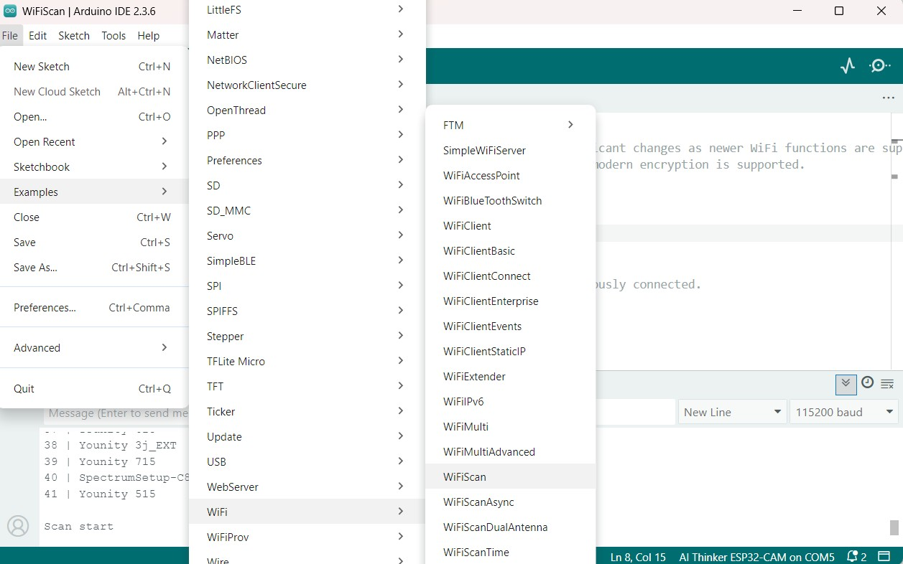
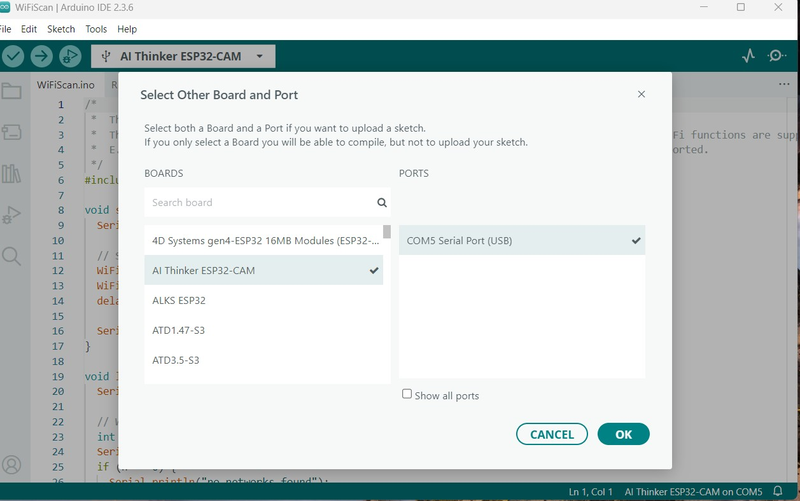

# ESP32-Wifi-Scanner
# WiFiScan Example
This example demonstrates how to use the WiFi library to scan available WiFi networks and print the results.
* Go to File>Examples>Wifi>WifiScan

* Select Other Board and Port > AI Thinker ESP32-CAM > COM? Serial Port (USB) > Ok to select the ESP32Cam (? could be any number).
  

## Example/Log Output

## Troubleshooting

***Important: Be sure you're using a good quality USB cable and you have enough power source for your project.***
* **COM port not detected:** Check the USB cable connection and the USB to Serial driver installation.

## Resources

* Arduino-ESP32 Official Repository: [espressif/arduino-esp32](https://github.com/espressif/arduino-esp32)
* ESP32 Datasheet: [Link to datasheet](https://www.espressif.com/sites/default/files/documentation/esp32_datasheet_en.pdf)
